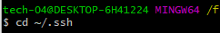
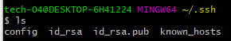
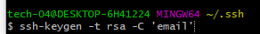
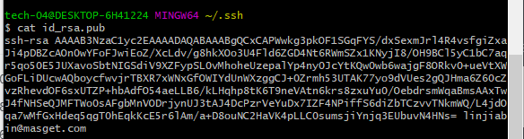
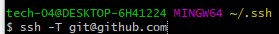

### 作用

通过设置SSH密钥可以省去每次操作都要输入用户名与密码。

### 步骤

1. 查看本地是否存在SSH密钥

   1. 进入**~/.ssh**目录

      

   2. 通过 **ls** 查看当前目录是否存在**id_rsa**文件

      

2. 生成SSH Key

   

   <!--email为github绑定的邮箱-->

3. 复制SSH Key

   

4. 在github中设置SSH Key

   进入 settings --> SSH and GPG keys --> New SSH key，其中**title**选填，默认为当前账号的邮箱地址，将在上一步复制的SSH Key黏贴到**key**中。

5. 测试

   在命令行通过 **ssh -T git@github.com**测试连通性

   

   当出现**Hi username You've successfully authenticated,but Github does not provide shell access.**即设置成功。

   <!--username为github用户名-->

### 可能遇到的问题